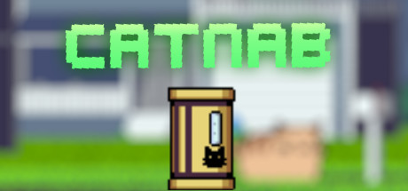
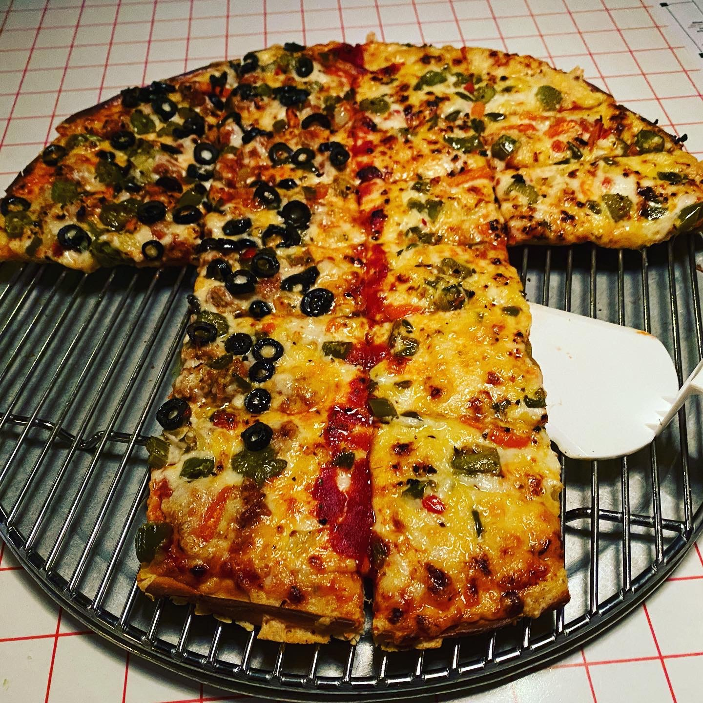

### 🤙 Hey, I'm Chris!  

- 🕹️ I like making games.
- 🔨 Working on [CatNab's Steam release](https://store.steampowered.com/app/1881800/CatNab/).
- 🍕 [Send me your favorite pizza joints!](mailto:chris@topher.games)  
  
             

### Shameless Self Promotion of the Day

-14 days until CatNab is out on Steam!

    
  

### Pizza Joint of the Day  

Barraco's Pizza  
3701 95th St, Evergreen Park, IL 60805, USA  
Monday: Open 24 hours

  

### Get in touch!  

  
  

<!--
Some inspiration from https://dev.to/dancurtis/self-updating-github-profile-readme-with-javascript-lhm

Here are some ideas to get you started:

- 🔭 I’m currently working on ...
- 🌱 I’m currently learning ...
- 👯 I’m looking to collaborate on ...
- 🤔 I’m looking for help with ...
- 💬 Ask me about ...
- 📫 How to reach me: ...
- 😄 Pronouns: ...
- ⚡ Fun fact: ...
-->
